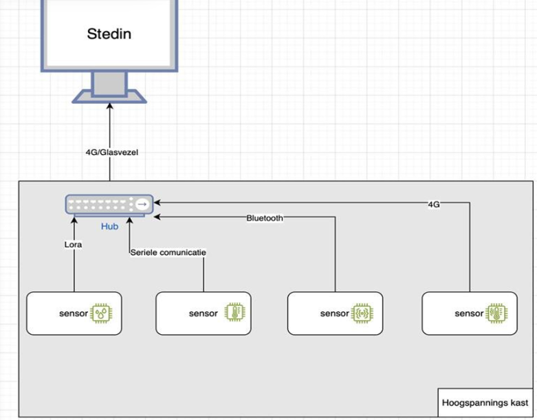

# Industrial-IOT-Hub  
---

## Table of Contents
- [Industrial-IOT-Hub](#industrial-iot-hub)
  - [Table of Contents](#table-of-contents)
  - [Project Overview](#project-overview)
  - [Repository Structure](#repository-structure)
  - [Purpose of the Repository](#purpose-of-the-repository)
  - [Key Features](#key-features)
  - [Contributors](#contributors)

---

## Project Overview
The project is a collaboration with **Stedin**, a major energy company in the Netherlands. Our main objective is to develop an IoT hub that contributes to a **more efficient energy transition**. The system monitors key environmental conditions such as **temperature and humidity** inside transformer stations, helping Stedin proactively **optimize network stability, safety, and efficiency**.

Currently, Stedin uses **multiple sensors per energy transformer hub**, all connected in a **decentralized and complex network** of inconsistent protocols and dashboards. Our goal is to **centralize** this into a **single, streamlined dashboard** that provides a **nationwide overview** of all hubs and sensors in the Netherlands, displaying data in a clear and accessible format.

The Netherlands is facing issues with **overloaded power lines**. Errors in the system can exacerbate these problems by adding more load to the grid. By improving data collection and monitoring, **errors can be detected earlier**, enabling **faster maintenance** and reducing strain on the grid.

We are building an **IoT hub**—a central Arduino-based system that collects data from multiple ESP32 devices equipped with sensors such as humidity and temperature sensors. The goal is to **streamline the data flow** from energy stations to **Stedin** using multiple protocols, enabling efficient data aggregation.

Each ESP32 collects sensor data and sends it to the central Arduino hub. From there, the data is processed and transmitted to a server with a **database and dashboard**.

This project focuses on researching how data collection from these hubs can be done **more efficiently**. Instead of delivering a complete product, our mission is to **explore potential improvements**. These insights can later be further developed or scaled.

---

## Repository Structure

The repository is organized into the following folders and files:

- **[images](images)**  
  Contains images and diagrams used in the documentation.

- **README.md**  
  This file, providing an overview of the project and instructions on where to find more information.

**Usage Guides**

- [General Usage Guide](markdown/Usage-guide.md).
  General setup of the project

- [Arduino Usage Guide](markdown/ArduinoUsage.md).
  Documenation specifically for the Arduino

- [Dashboard Usage Guide](markdown/DashboardUsage.md).
  Documenation specifically for the Dashboard and the Database
  
---

## Purpose of the Repository

This GitHub repository serves as the central hub for:
- **Source code**: Including dashboard development and Arduino/ESP32 scripts.
- **Documentation**: Project plans, development tests, results, 

For setup instructions, refer to the [Usage Guide](markdown/Usage-guide.md).

---

## Key Features

- **Improved real-time monitoring** of transformer station environmental conditions  
- **Enhanced predictive maintenance**, reducing manual checks and improving fault detection  
- **Optimized performance** of the national energy infrastructure  
- **Centralized dashboard** offering access to all sensors in the country via one interface  

---

## Contributors

* **Derk O.**

  1. Developed MQTT integration for secure data transmission to the Mosquitto broker.
  2. Created a Python-based collector to forward data into InfluxDB.
  3. Designed and implemented the InfluxDB time-series database setup.
  4. Built and styled a real-time dashboard using a Flask API, served through NGINX.
  5. Dockerized all services to ensure consistent and portable deployment.
  6. Created the project architecture and setup documentation, including the main README and usage guides.

(jullie moeten zelf iets voor jezelf invullen)
- **Femke H.** – Database setup, research, and documentation  
- **Marit S.** – Arduino design, testing, and documentation  
- **Subaydah M.** – Arduino setup, testing, frontend integration, and documentation  
- **Tibor van de K.** – Arduino design, documentation, and testing  

For questions or contributions, please open an issue on GitHub.

---

Designed and implemented the complete data pipeline for an Industrial IoT system:

* Collected environmental sensor data using an ESP32-based IoT hub.
* Transmitted data securely via MQTT to a Mosquitto broker.
* Used a Python collector to forward the data into InfluxDB.
* Built a real-time dashboard powered by a Flask API and served via NGINX.
* Dockerized all services for consistent deployment
* Created structured documentation and README for ease of use and replication
