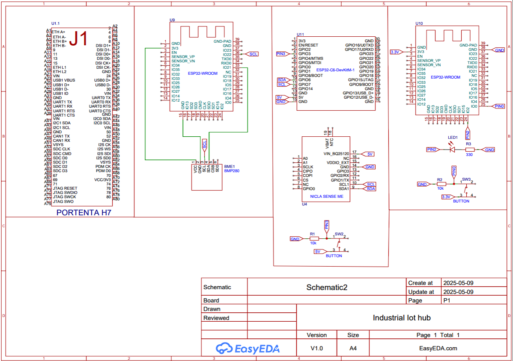

# Arduino Usage Guide

This guide provides a comprehensive tutorial for setting up your Arduino-based IoT project.

-----

## Table of Contents

- [Arduino Usage guide](#arduino-usage-guide)
    - [Table of Contents](#table-of-contents)
    - [Physical setup](#physical-setup)
    - [Connecting the arduino to the network](#connecting-the-arduino-to-the-network)
    - [Monitoring the Iot-hub](#monitoring-the-hub)


-----

### Physical Setup

This project utilizes four primary physical devices:

1.  **Your Computer (Host Machine)**

      * Runs Docker Containers. Refer to the Dashboard Usage Guide for more details.
      * Displays the project dashboard.

2.  **Arduino Portenta Max H7**

      * Functions as the main IoT-Hub, retrieving sensor data from the ESP32s.
      * Sends this collected data to the host machine for display.

3.  **First ESP32-WROOM (Leo)**

      * Equipped with a BMP280 sensor to read humidity and temperature data.
      * Connects to the IoT-Hub via Wi-Fi to transmit data.

4.  **Second ESP32-WROOM (Sam)**

      * Features a sensor that measures pressure.
      * Sends the pressure data to the IoT-Hub.

5.  **Third ESP (Mia)**

      * Communicates with the IoT-Hub using CAN bus.
      * Includes a button to indicate system status (on/off) when pressed.
      * **Note:** This ESP32's setup is not yet complete and is not used in the current DEMO.

All components listed above are presented in the order they appear in the electrical schematic.

-----

#### Electrical Schematics



-----

### Connecting the Arduino to the Network

To display live sensor data on your Dashboard, you need to make some adjustments to the code after the hardware setup is complete and before uploading.

1.  Navigate to `esp_wifi.ino` (for Leo) located at [`../arduinocodes/esp_wifi.ino`](https://www.google.com/search?q=../arduinocodes/esp_wifi.ino). Modify the following lines:

    ```cpp
    // Change this to your Wi-Fi Network credentials
    const char* ssid = "bliep";
    const char* password = "37al63mf32qj";

    // Server URL (Portenta H7 IP address). This may change if you connect to a different network
    // and must be adjusted accordingly.
    const char* serverURL = "http://172.20.10.11:8080/data";
    ```

2.  Navigate to `CentralEnd.ino` located at [`../arduinocodes/CentralEnd.ino`](https://www.google.com/search?q=../arduinocodes/CentralEnd.ino). Modify the following lines:

    ```cpp
    // Wi-Fi credentials (Change to your network)
    const char* ssid = "bliep";
    const char* password = "37al63mf32qj";
    // Change IP to your host machine's IP address
    const char* mqtt_server = "172.20.10.14";
    ```

    To determine your host machine's IPV4 address, please refer to the Dashboard Usage Guide.

Once these settings have been adjusted to your environment, you are ready to upload the scripts:

  * `esp_ble.ino` (for Sam)
  * `esp_wifi.ino` (for Leo)
  * `CentralEnd.ino` (for Portenta Max H7)


If you are using Arduino IDE to upload the scripts it is imporant to also install these libraries, aside them being in the code

```
#include <ArduinoBLE.h>
#include <WiFi.h>
#include <PubSubClient.h>
```
For detailed documentation on uploading Arduino scripts, please visit [https://docs.arduino.cc](https://docs.arduino.cc)

-----

## Monitoring the Hub

To verify that your devices are communicating effectively, observe the Serial Monitor of the IoT-Hub. The terminal will display logs similar to these:

  * `Wifi Connected`
  * `subscribed to mqtt broker on topic sensor/data`
  * `Searching for BLE`
  * `BLE Connected`
  * `Received data from BLE`
  * `Received data from WIFI`
  * `Published sensordata to broker`

If you encounter any errors, it is most likely due to incorrect IP addresses or network configurations within the code.