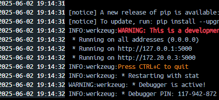
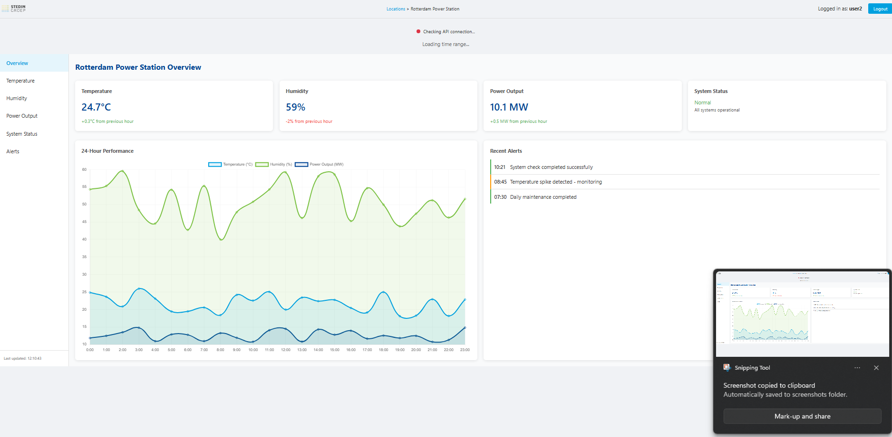
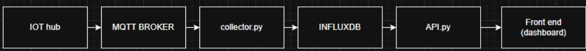

# Dashboard Usage Guide

This setup guide explains how to launch the current project, followed by instructions to replicate it yourself.

## Table of Contents

- [Dashboard Usage Guide](#dashboard-usage-guide)
  - [Table of Contents](#table-of-contents)
  - [Launching the Dashboard](#launching-the-dashboard)
    - [Cloning the Git Repository](#cloning-the-git-repository)
    - [Changing IP Addresses to Match Your Setup](#changing-ip-addresses-to-match-your-setup)
    - [Installing Docker](#installing-docker)
    - [Launching the Project](#launching-the-project)
      - [The Dashboard](#the-dashboard)
  - [Deep Dive in the Dashboard Setup](#deep-dive-in-the-dashboard-setup)
    - [📡 Network Overview](#-network-overview)
    - [1. Connect the Hub to the Broker](#1-connect-the-hub-to-the-broker)
    - [2. InfluxDB](#2-influxdb)
    - [3. The Data Collector](#3-the-data-collector)
      - [API Token](#api-token)
    - [4. Dashboard and Custom API](#4-dashboard-and-custom-api)
    - [5. Docker Compose Overview](#5-docker-compose-overview)
      - [Services](#services)


## Launching the Dashboard

### Cloning the Git Repository

1.  Head to the git repository.
2.  Click the green ` <> code ` button and copy the link.
3.  Create a new project directory in your preferred code editor.
4.  In the terminal, type `git clone "link"`.

### Changing IP Addresses to Match Your Setup

First things first: it is crucial to change the IP address on every device:
* The main host computer that is running the Docker container.
* The Arduino Portenta Max H7 (the main IoT-hub).
* The Arduino ESP32's (the devices with attached sensors).

1.  Open [`collector.py`](../dashboard/backend/collector.py) and change the IP on the line:

    ```python
    ip_adress = "xxx.xxx.xxx.xxx"
    ```

    to your own IPv4 address, which can be found by typing `ipconfig` in the terminal.

### Installing Docker

1.  Head to `https://www.docker.com`.
2.  Install Docker from the download page.
3.  Follow the installation wizard.

### Launching the Project

1.  Make sure Docker Desktop is running.
2.  Open the terminal in the `Industrial-IOT-Hub/dashboard/` directory.
3.  Run:

    ```bash
    docker-compose build
    docker-compose up -d
    ```

    All containers and the dashboard will be launched.

#### The Dashboard

Our project contains two dashboards:


* **Real-time Dashboard:** ```dashboard/public```
Displays live data collected by the IoT-hub in graphs.
    1.  To access the dashboard, open the `dashboard-app` container:

        

        This address is where the dashboard is hosted. Paste it into your browser.

* **Test Dashboard:**  ```dashboard/public/index.html```
This dashboard is an example of what an official Stedin website for checking sensor data might look like. Stedin has multiple power stations, hence it should be easy to access multiple different stations through one dashboard. It also features a login screen.

    
    The above dashboard's primary purpose is to provide a clean overview that can access all graphs from around the country. It is important to note that this is a demo, which includes dummy sensor data rather than live data retrieved by physical sensors. Access this dashboard by heading to `localhost:80` in your browser.

## Deep Dive in the Dashboard Setup

### 📡 Network Overview



The network flow consists of multiple parts. This guide walks you through the setup so it can be replicated. Every process in the diagram is launched through Docker containers, aside from the IOT-hub (Arduino Portenta Max H7) and the sensors (ESP32)

1. ESP32 Sensor Data Collection: Two ESP32s with attached sensors collect data and transmit it to the IoT-hub.
2. IoT-hub to MQTT Broker: The IoT-hub receives data from the ESP32s and publishes it to the MQTT broker on the sensor/data topic.
3. Data Collection by collector.py: The collector.py script continuously listens for new messages on the sensor/data topic from the MQTT broker.
4. Data Storage in InfluxDB: Upon receiving new data from the broker, the collector.py script stores this data in the InfluxDB database.
5. API Data Retrieval and Formatting: The API can then read data from InfluxDB and formats it appropriately for visualization.
6. Dashboard Visualization: Finally, the Dashboard accesses the API to retrieve the formatted data, enabling it to display real-time graphs.
   
### 1. Connect the Hub to the Broker

Please refer to the [Arduino Usage Guide](ArduinoUsage.md).

### 2. InfluxDB

1.  InfluxDB is the database used. It has its own UI when the Docker container is launched. To access it, open:

    ```
    http://localhost:8086
    ```

2.  To log in, head to [`docker-compose.yml`](../dashboard/docker-compose.yml).
3.  In the `influxdb` service section, the credentials are shown:

    ```yaml
    - DOCKER_INFLUXDB_INIT_USERNAME=admin
    - DOCKER_INFLUXDB_INIT_PASSWORD=yourpassword
    ```

4.  For documentation, visit: `https://docs.influxdata.com`.
5.  A setup (wich is already done) is needed consisting of:
    * An initial user 
    * An organization 
    * A new bucket 

### 3. The Data Collector

[`collector.py`](../dashboard/backend/collector.py) checks whether new data has been posted on the `sensor/data` topic in the MQTT broker. Once new data is found, it stores it in the database.

#### API Token

1.  In InfluxDB, press "Load Data" and navigate to the `API` submenu.
2.  Here you can generate an API token that controls read and write access to your database.

This API token is used in [`collector.py`](../dashboard/backend/collector.py) to enable it to read data from the MQTT broker and store it in InfluxDB.

### 4. Dashboard and Custom API

For storing data in the database and displaying it, a custom API is used. This API also scrapes data from the database and serves it to the frontend for visualization.

Both the [Custom API](../dashboard/RealTimeDashboard/app.py) and the [Frontend](../dashboard/RealTimeDashboard/templates/index.html) reside in the `RealTimeDashboard` folder. The folder structure is organized so that all dashboard logic (backend and frontend) is encapsulated in one place for easier maintenance and deployment.


In this script, the token which manages read and write access to the InfluxDB database is stored.

The API acts as a secure intermediary between the backend (InfluxDB) and the frontend. Since direct access to InfluxDB requires sensitive credentials (such as an API token), which must be kept secure, the API performs all database queries on behalf of the frontend. This ensures the frontend never exposes any critical secrets or credentials to the browser.

Additionally, the API layer allows you to preprocess, aggregate, and format data before sending it to the frontend. This separation of concerns improves scalability, security, and maintainability of the overall system.

### 5. Docker Compose Overview

This [`docker-compose.yml`](../dashboard/docker-compose.yml) file defines the services required to run a secure and integrated Industrial IoT dashboard system. Below is a brief explanation of each service and its role in the architecture.

#### Services

1.  **web (Nginx)**
    * **Purpose:** Acts as a reverse proxy and serves static files.
    * **Ports:** Exposes HTTP (80) and HTTPS (443).
    * **Volumes:**
        * SSL certificates.
        * Nginx config.
        * Static web files.
    * **Used by:** The Demo Dashboard.

2.  **mosquitto (MQTT Broker)**
    * **Purpose:** Handles real-time message passing between the IoT-hub and services.
    * **Ports:** 1883 for standard MQTT, 1884 for alternative use.
    * **Security:** Includes configuration, password, and ACL files. SSL support enabled.
    * **Used by:** Both the Real-time Dashboard and the Demo Dashboard.

3.  **dashboard\_app (Flask Dashboard)**
    * **Purpose:** Hosts the real-time web dashboard for data visualization.
    * **Runs:** Python Flask app (`app.py`).
    * **Port:** 5000 (web interface).
    * **Dependencies:** Installed at container startup. ```requirments.txt```

4.  **data\_collector (MQTT to InfluxDB Bridge)**
    * **Purpose:** Listens to MQTT topics and stores data in InfluxDB.
    * **Dependencies:** Requires both Mosquitto and InfluxDB to be up first.
    * **Used by:** The realtime Dashboard

5.  **influxdb**
    * **Purpose:** Time-series database storing IoT sensor data.
    * **Port:** 8086 (web UI & API access).
    * **Initialization:** Automatically creates a user, organization, bucket, and admin token.
    * **Used by:** The realtime Dashboard
